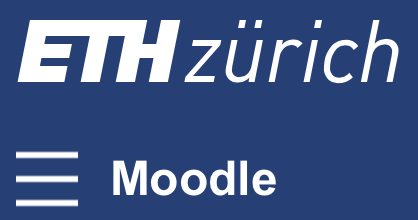

# Logistics

)

!!! tip "Suggestion"
    Bookmark this page for easy access to all the information you need for the course.

## Course structure

Each lecture contains material on physics, numerics, and technical concepts, as well as exercises. The lecture content is outlined in its introduction using the following items for each type of content:

- 📚 **Physics**: equations, discretisation, implementation, solver, visualisation
- 💻 **Code**: technical, Julia, GitHub
- 🚧 **Exercises**

The course will be taught in a "flipped classroom" fashion: you will study the lecture materials at home, and in the classroom you will work on hands-on exercises and participate in group discussions.

## Lectures

- Tuesdays 12h45-15h30 in [HCI E8](https://ethz.ch/staffnet/en/utils/location.html?building=HCI&floor=E&room=8).

## Discussion

We use [Element](https://chat.ethz.ch/) as the main channel for communication between the teachers and the students, and hopefully also between students. We encourage ETH students to ask and answer questions related to the course, exercises and projects there.

Head to the [_Element chat_ link on Moodle]($(course_info["moodle_url"])) to get started with Element:

1. Select **Start Student-Chat**
2. Log in using your NETHZ credentials to start using the browser-based client
3. Join the **_General_** and **_Helpdesk_** rooms
4. Download the [desktop or mobile client](https://element.io/) for more convenient access or in case of encryption-related issues

## Homework and submission

Before each class, study the assigned lecture materials and post questions in the Element chat. During class, you will work on exercises and submit them in two steps:

1. At the end of class, you will submit your current progress on Moodle. It doesn't have to be complete, but it should be a reasonable draft of the solution. **This submission won't be graded**, but we will check which exercises you worked on during class.
2. Before **23:59 on Wednesday** following the lecture, you will submit the final version of the code. **This submission will be graded**, but we will only assign points to exercises showing sufficient state of progress in the end-of-class submission:
   - The exercise should be submitted by the end of class
   - The submission should conain the skeleton of correct solution (> 50% of tasks completed)
   - Missing visualisation and minor code bugs are acceptable in the end-of-class submission

Submit Pluto notebooks on Moodle for weeks 1 and 2. From **week 3 onwards**, develop your solutions in your private course GitHub repository and submit both the final commit hash (SHA) and the pull request URL on [Moodle]($(course_info["moodle_url"])).

### Private GitHub repository setup

Once you have your GitHub account ready (see lecture 2 [how-to](/lecture2/#a_brief_git_demo_session)), create a private repository you will _**share with the teaching staff only**_ to upload your weekly assignments:

1. Within the [pdes-on-gpus-julia-course](https://github.com/pdes-on-gpus-julia-course) organisation, create a **private** GitHub repository named `pde-on-gpu-<moodleprofilename>`, where `<moodleprofilename>` has to be replaced by your name **as displayed on Moodle, lowercase, diacritics removed, spacing replaced with hyphens (-)**. For example, if your Moodle profile name is "Joël Désirée van der Linde", your repository should be named `pde-on-gpu-joel-desiree-van-der-linde`.
2. Select the `MIT License` and add a `README.md` file.
3. **For each homework submission**, you will:
    - create a Git branch named `homework-X` (X ``\\in [2-...]``) and switch to that branch (`git switch -c homework-X`);
    - create a new folder named `homework-X` to put the exercise code into;
    - (don't forget to `git add` the code files and `git commit` them);
    - push to GitHub and open a pull request (PR) targeting the `main` branch on GitHub;
    - copy **the single Git commit hash (SHA) after the final push and the link to the PR** and submit **both** on [Moodle]($(course_info["moodle_url"])) as the assignment hand-in (this will allow us to verify that the material was pushed on time);
    - (do not merge the PR yet).

!!! warn
    Keep the repository lightweight: include the homework folders, `README.md`, license, and required configuration files; exclude large outputs.

!!! note
    For homework 3 and later, the respective folders on GitHub should be Julia projects and thus must contain a `Project.toml` file. The `Manifest.toml` file should be excluded from version control. To do so, add it as an entry to a `.gitignore` file in the root of your repo. Mac users may also add `.DS_Store` to their [global `.gitignore`](https://docs.github.com/en/get-started/getting-started-with-git/ignoring-files#configuring-ignored-files-for-all-repositories-on-your-computer). Code could be placed in a `scripts/` folder. Output material to be displayed in the `README.md` could be placed in a `docs/` folder.

### Feedback

After the submission deadline, we will review and grade your assignments. You will get personal feedback directly on the PR as well as on [Moodle]($(course_info["moodle_url"])). Once you have received feedback, please merge the PR.
We will try to correct your assignments before the lecture following the homework's deadline.

## Final project

🚧 Under construction.

<!--
## Project

1. Within your `pde-on-gpu-<moodleprofilename>` folder, copy over the `PorousConvection` you can find in the `l9_project_template` folder within the [scripts](https://github.com/eth-vaw-glaciology/course-101-0250-00/tree/main/scripts) folder. Make sure to copy the entire folder as not to loose the hidden files.
2. Follow the specific instructions given in [Lecture 8 - infos about projects](/lecture8/#infos_about_projects).
3. During lectures 8 and 11 you will be asked to add material to the `PorousConvection` folder as part of regular homework hand-in _which will serve as evaluation for the Part 2 (35% of the final grade)_ (see [Evaluation](#evaluation) section).

### Project hand-in checklist

The project submission deadline is set to **18.12.2026 - 23h59 CET** (see also [Homework](/homework)). The final GitHub SHA has to be added to [Moodle]($(course_info["moodle_url"])) in the Lecture 11 section.

Make sure to have following items in your private GitHub repository:

- a `PorousConvection` folder containing the structure proposed in [Lecture 8](/lecture8/#preparing_the_project_folder_in_your_github_repo)
- the 2D and 3D scripts from Lecture 8
- the CI set-up to test the 2D and 3D porous convection scripts
- a `lecture_9` folder (different from the PorousConvection folder) containing the codes, `README.md` and material listed in [Exercises - Lecture 9](/lecture9/#exercises_-_lecture_9)
- the 3D multi-xPU thermal porous convection script and output as per directions from [Exercises - Lecture 11](/lecture11/#exercises_-_lecture_11).

**In addition** enhance the `README.md` within the `PorousConvection` folder to include:

- a short motivation/introduction
- concise information about the equations you are solving
- concise information about the numerical method and implementation
- the results, incl. figures with labels, captions, etc...
- a short discussion/conclusion section about the performed work, results, and outlook

_Note that for evaluation will be considered the following (non-exhaustive) items: code correctness, style, and conciseness; implementation of demanded tasks; final layout and rendering, ..._

-->

## Evaluation

Enrolled ETHZ students will have to hand in on [Moodle]($(course_info["moodle_url"])) and [GitHub](https://github.com):

1. Nine weekly assignments during the course constitute 35% of the final grade. The lowest grade will be dropped.
2. A project developed during the course constitutes 65% of the final grade.

**Project submission includes code in a GitHub repository and automatically generated documentation**.

## The use of large language models (LLMs)

- LLMs can be very helpful, but using them during class or to write your final project can prevent you from developing the skills the course is designed to teach.
- We cannot stop you from using LLMs, but we strongly discourage ["vibe coding"](https://en.wikipedia.org/wiki/Vibe_coding). You are fully responsible for your code and results.
- Your final project repository **must** include a section in the README stating which AI tools were used, for which tasks, and how they contributed to the project.

!!! tip
    Read these materials if you're interested in responsible use of LLMs:
    - [Using LLMs at Oxide](https://rfd.shared.oxide.computer/rfd/0576)
    - [LLVM AI tool policy: human in the loop](https://discourse.llvm.org/t/rfc-llvm-ai-tool-policy-human-in-the-loop/89159)
