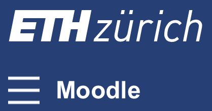

# Logistics

)

!!! tip "Suggestion"
    Bookmark this page for easy access to all the information you need for the course.

## Course structure

Each lecture contains material on physics, numerics, and technical concepts, as well as exercises. The lecture content is outlined in its introduction using the following items for each type of content:

- 📚 **Physics**: equations, discretisation, implementation, solver, visualisation
- 💻 **Code**: technical, Julia, GitHub
- 🚧 **Exercises**

The course will be taught in a "flipped classroom" fashion: you will study the lecture materials at home, and in the classroom you will work on hands-on exercises and participate in group discussions.

## Lectures

- Tuesdays 12h45-15h30 in [HCI E8](https://ethz.ch/staffnet/en/utils/location.html?building=HCI&floor=E&room=8).

## Discussion

We use [Element](https://chat.ethz.ch/) as the main channel for communication between the teachers and the students, and hopefully also between students. We encourage ETH students to ask and answer questions related to the course, exercises and projects there.

Head to the [_Element chat_ link on Moodle]($(course_info["moodle_url"])) to get started with Element:

1. Select **Start Student-Chat**
2. Log in using your NETHZ credentials to start using the browser-based client
3. Join the **_General_** and **_Helpdesk_** rooms
4. Download the [desktop or mobile client](https://element.io/) for more convenient access or in case of encryption-related issues

## Homework and submission

Before each class, study the assigned lecture materials and post questions in the Element chat. During class, you will work on exercises and submit them in two steps:

1. At the end of class, you will submit your current progress on Moodle. It doesn't have to be complete, but it should be a reasonable draft of the solution. **This submission won't be graded**, but we will check which exercises you worked on during class.
2. Before **23:59 on Wednesday** following the lecture, you will submit the final version of the code. **This submission will be graded**, but we will only assign points to exercises showing sufficient state of progress in the end-of-class submission:
   - The exercise should be submitted by the end of class
   - The submission should conain the skeleton of correct solution (> 50% of tasks completed)
   - Missing visualisation and minor code bugs are acceptable in the end-of-class submission

Submit Pluto notebooks on Moodle for weeks 1 and 2. From **week 3 onwards**, develop your solutions in your private course GitHub repository and submit both the final commit hash (SHA) and the pull request URL on [Moodle]($(course_info["moodle_url"])).

### Private GitHub repository setup

Once you have your GitHub account ready (see lecture 2 [how-to](https://pde-on-gpu.vaw.ethz.ch/part1_introduction/lecture02/#A-brief-Git-demo)), create a private repository you will **share with the teaching staff only** to upload your weekly assignments:

1. Submit your GitHub user handle to [Moodle]($(course_info["moodle_github_url"])).
2. Within the [pdes-on-gpus-julia-course](https://github.com/pdes-on-gpus-julia-course) organisation, create a **private** GitHub repository named `pde-on-gpu-<moodleprofilename>`, where `<moodleprofilename>` has to be replaced by your name **as displayed on Moodle, lowercase, diacritics removed, spacing replaced with hyphens (-)**. For example, if your Moodle profile name is "Joël Désirée van der Linde", your repository should be named `pde-on-gpu-joel-desiree-van-der-linde`.
3. Select the `MIT License` and add a `README.md` file.
4. **For each homework submission**, you will:
    - create a Git branch named `homework-X` (X ``\\in [2-...]``) and switch to that branch (`git switch -c homework-X`);
    - create a new folder named `homework-X` to put the exercise code into;
    - (don't forget to `git add` the code files and `git commit` them);
    - push to GitHub and open a pull request (PR) targeting the `main` branch on GitHub;
    - copy **the single Git commit hash (SHA) after the final push and the link to the PR** and submit **both** on [Moodle]($(course_info["moodle_url"])) as the assignment hand-in (this will allow us to verify that the material was pushed on time). **Use the same PR for the end-of-class submissions and for the final submissions.**;
    - (do not merge the PR yet).

!!! warn
    Keep the repository lightweight: include the homework folders, `README.md`, license, and required configuration files; exclude large outputs.

!!! note
    For homework 3 and later, the respective folders on GitHub should be Julia projects and thus must contain a `Project.toml` file. The `Manifest.toml` file should be excluded from version control. To do so, add it as an entry to a `.gitignore` file in the root of your repo. Mac users may also add `.DS_Store` to their [global `.gitignore`](https://docs.github.com/en/get-started/getting-started-with-git/ignoring-files#configuring-ignored-files-for-all-repositories-on-your-computer). Code could be placed in a `scripts/` folder. Output material to be displayed in the `README.md` could be placed in a `docs/` folder.

### Feedback

After the submission deadline, we will review and grade your assignments. You will get personal feedback directly on the PR as well as on [Moodle]($(course_info["moodle_url"])). Once you have received feedback, please merge the PR.
We will try to correct your assignments before the lecture following the homework's deadline.

## Final projects

**Project's due date is December 17, 2026 -- 23h59 CET (enforced by a "release tag v1.0.0").**

The list of available topics, the expected content of the project repository, and the presentation format are described on the [Final projects](/final_projects/) page.

### Getting started

The following steps will get you started on your final project:

1. Find a classmate to team up with. If you don't find anyone, reach out to the teaching staff.
2. Read through the proposed topics on the [Final projects](/final_projects/) page.
3. Choose a preferred topic and an alternative one.

<!-- 3. Initiate a **private** GitHub repository for your project (CamelCaps, including `.jl` at the end - e.g.: `MyProject.jl`) in the [pdes-on-gpus-julia-course](https://github.com/pdes-on-gpus-julia-course) GitHub organisation.
4. Send an email to Ivan (iutkin@ethz.ch) and Ludovic (luraess@ethz.ch) by **Tuesday December 3, 2024**, with subject _**Final projects**_ including
    - your project partner
    - a brief description of your choice
    - a link to your final project GitHub repository
    - _anything else missing in this list_
5. Work on your final project, asking for help
    - in the Element _Helpdesk_ channel for general question
    - as **GitHub "issue"** for project specific questions
    - during class hours serving as helpdesk -->

### Final project submission

Submission deadline for the project is **December 17, 2026 -- 23h59 CET**.

Final submission timestamp is enforced upon tagging the `v1.0.0` version release of your repository. See [GitHub docs](https://docs.github.com/en/repositories/releasing-projects-on-github/about-releases) for infos.

Add the last commit SHA to [Moodle - Final project submission]($(course_info["moodle_final_project_url"])) as for the exercises.

## Evaluation

Enrolled ETHZ students will have to hand in on [Moodle]($(course_info["moodle_url"])) and [GitHub](https://github.com):

1. Nine weekly assignments during the course constitute 35% of the final grade. The lowest grade will be dropped.
2. A project developed during the course constitutes 65% of the final grade.

**Project submission includes code in a GitHub repository and automatically generated documentation**.

## The use of large language models (LLMs)

!!! warning
    We will probably adjust these guidelines as the course develops

- LLMs can be very helpful, but using them during class or to write your final project can prevent you from developing the skills the course is designed to teach.
- No ["vibe coding"](https://en.wikipedia.org/wiki/Vibe_coding), instead, use LLMs as a tutor.
- We require that you understand all the numerical code that you write and hand in as homework. You are fully responsible for your code and results.
- Your final project repository **must** include a section in the README stating which AI tools were used, for which tasks, and how they contributed to the project.

!!! tip
    Read these materials if you're interested in responsible use of LLMs:
    - [Using LLMs at Oxide](https://rfd.shared.oxide.computer/rfd/0576)
    - [LLVM AI tool policy: human in the loop](https://discourse.llvm.org/t/rfc-llvm-ai-tool-policy-human-in-the-loop/89159)
